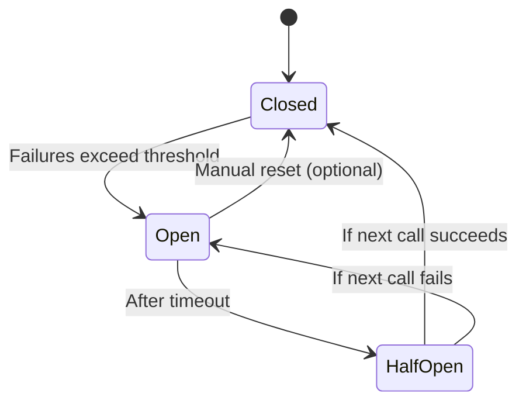

# Circuit Breaker 

#SystemDesign 

> [Circuit Breaker Pattern (Design Patterns for Microservices) \| by Hasitha Subhashana \| Geek Culture \| Medium](https://medium.com/geekculture/design-patterns-for-microservices-circuit-breaker-pattern-276249ffab33)
> Release It Design and Deploy Production-Ready Software, Chapter 5: Stability Pattern - Michael T. Nygard

Circuit Breakers prevent **Cascading Failures**. (💡Like SQL Cascade)

Circuit breaker is a mechanism that stops a client repeatedly attempting an operation that is likely to fail.
> If a service is failing repeatedly, the circuit "breaks" the connection temporarily to stop more failures and allow the system to recover.

With respect to downstream services, a circuit breaker  calculates the number of requests that failed within a recent interval. If an error thresh- old is exceeded, the client stops calling downstream services. Sometime later, the client  attempts a limited number of requests. If they are successful, the client assumes that the failure is resolved and resumes sending requests without restrictions. 

## Example Scenario

1. Service A calls Service B.
2. Service B is slow or down.
3. Circuit breaker detects repeated timeouts/errors.
4. Circuit opens — now Service A instantly fails requests to B (or uses fallback).
5. After some time, a few requests go through (half-open).
6. If they succeed, circuit closes again.
## Circuit Breakers Implementation

How is it implemented ?
- A common database holds the settings for each breaker.
- Services, before making call to others, checks the config
	- Cache the config to avoid checking the DB

## Using Libraries in Production

If you want more powerful and configurable circuit breakers, use:

|Language|Library/Tool|Notes|
|---|---|---|
|**Java**|`Resilience4j`|Lightweight, modern|
|**.NET**|[`Polly`](https://github.com/App-vNext/Polly)|Powerful retry/circuit-breaker policies|
|**Node.js**|[`opossum`](https://www.npmjs.com/package/opossum)|Full-featured circuit breaker lib|
|**Service Mesh**|Istio, Envoy|Circuit breaker at infra level (no code needed)|

