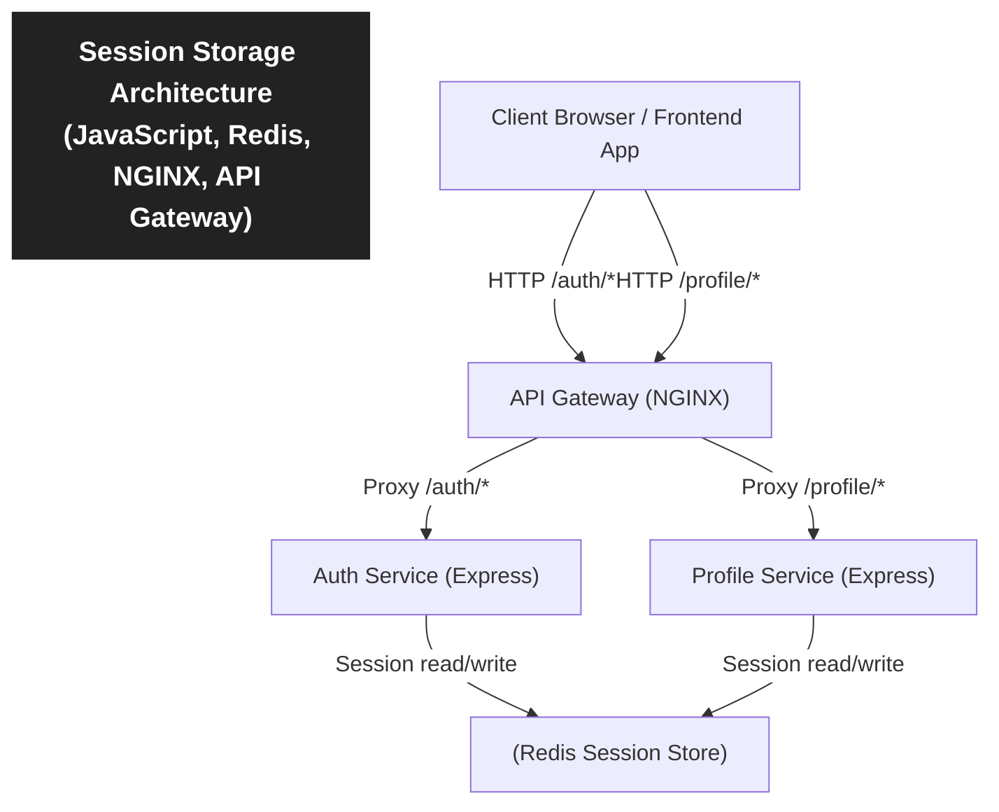

> [!NOTE]
> This project demonstrates a session-based microservices architecture using JavaScript, Redis, Express, and NGINX. Sessions are stored in Redis via `express-session` and `connect-redis`, allowing stateless Node.js services like `profile-service` to persist user sessions. An NGINX API Gateway proxies requests to individual services (e.g., `/auth/` and `/profile/`), forwarding client headers and maintaining a consistent interface. This setup enables centralized session management, scalability, and a clean separation between services behind a single gateway.

